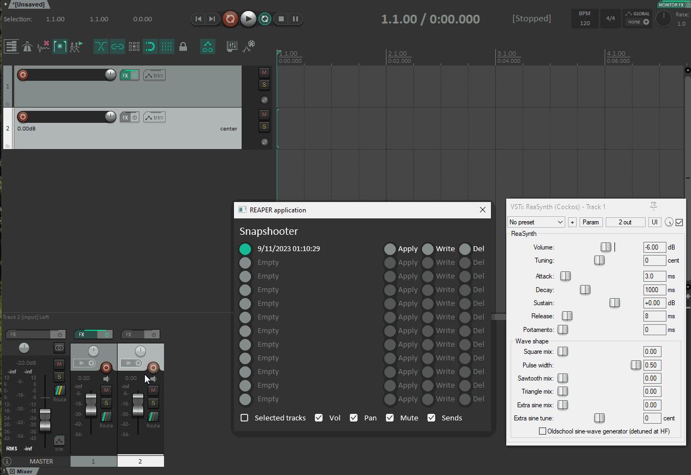

# Snapshooter

Reaper snapshots plugin

Snapshooter allows to create param snapshots and recall them or write them to the playlist creating patch morphs.
Different from SWS snapshots, only the params changed are written to the playlist as automation points.

Features:
  * Stores and retrieves FX params
  * Stores and retrieves mixer states for track Volume, Pan, Mute and Sends
  * Writes only changed params by diffing the current state and selected snapshot
  * Tested with hundreds of params with minimal overhead

Tips:
  * Set global automation to __READ__ to save current song snapshot
  * Set global automation to other value than __READ__ to save snapshots from mixer state
  * If params are not writing make sure they have a different current value from the snapshot
